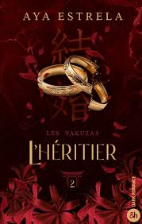

# Welcome 🌸
Bienvenue dans mon bookclub! Fan de romance et de fantasy, je vous partage mes lectures du mois, mes avis et mes recommandations.

## Septembre 🌤️

En ce moment, je lis L'héritier ( les yakuzas, #2) 

 Ils ont tout perdu… sauf l’espoir de se retrouver.
De retour en Russie, Nikita tombe sous la coupe d’un frère qui n’a plus aucune raison de la ménager. Isolée et trahie, elle doit apprendre à survivre dans un monde qui cherche à l’engloutir.
Au Japon, le clan Hitake vacille sous l’assaut d’un Héritier déterminé à renverser l’ordre établi. Contraint de défendre son titre d’Oyabun, Kuro doit aussi faire face aux répercussions de ses propres choix. Pourtant, une obsession demeure : retrouver Nikita, coûte que coûte.
Entre eux, l’amour a le goût d’une rédemption qui guérit autant qu’elle mutile. Leur union pourrait devenir une renaissance… ou le dernier acte d’une tragédie 

Trigger warning !!  

Pour l'acheter : [Amazon](https://www.amazon.fr/gp/product/B0GDD56F94?ie=UTF8&tag=cnd-anon-new-21&linkCode=xm2&camp=1642&creative=6746&creativeASIN=B0GDD56F94)

[ link to my introduction](introduction)
[link to my secondpage.md ](https://github.com/oceana3/Exercice-/blob/main/secondpage.md)

[UBO ](https://www.univ-brest.fr/fr)

